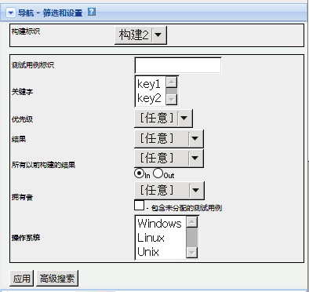

=================
TestLink 用户手册
=================

---------------------
基于TestLink 1.8 版本
---------------------

:作者: 王 胜
:公司: 北京群英汇信息技术有限公司
:联系: http://www.ossxp.com/
:版本: 1.0
:日期: |date|

.. contents:: 目录
.. sectnum::
.. header:: TestLink 用户手册
.. footer:: 北京群英汇信息技术有限公司
.. |date| date:: %Y-%m-%d %H:%M

系统介绍
=========

TestLink 是一个基于Web的测试管理工具。 

主要功能

* 测试需求的管理
* 测试计划的管理
* 测试用例的管理
* 测试用例的执行
* 测试结果的分析 (包括测试结果的图表分析)
* 基于角色的用户管理

系统整体结构
-------------

TestLink系统共有三大基石：测试项目，测试计划和用户。其它的所有数据都与这三大基石相关或者是它们的属性。

   TestLink里测试项目的基本组件

基本术语
--------

下面介绍一下软件测试里常用的术语：

* 测试用例

  通过测试步骤（动作，场景）和预期结果来描述一个测试任务。测试用例是TestLink里最基本成分。
* 测试套件

  测试用例的组织单元。它构成测试规约的逻辑部分。
* 测试计划

  在你执行测试用例之前，需要创建一个测试计划。测试计划包括构建，里程碑，用户指派和测试结果。
* 测试项目

  测试项目指待测试的项目，它可以根据被测项目的生命周期建立不同的版本。测试项目包括测试规约以及测试用例，需求规约和关键字。

* 用户

  每一个TestLink用户都有一个角色。

  .. figure:: images/usecase.png
     :scale: 50

     TestLink用例图

测试规约
=========

TestLink将测试规约拆分为测试套件和测试用例，他们将会在整个应用中长期存在。一个测试项目只能包含一个测试规约。

测试套件
---------

测试套件用来组织测试用例。测试套件可以包含测试用例和其它的测试套件。TestLink用树状结构来显示测试套件。

用户（具有编辑权限）可以创建、删除、复制、移动、导入和导出测试套件和测试用例。

在测试规约导航树中，可以通过拖拽灵活组织测试用例与测试套件之间层次结构。

实战1::

  在构建测试规约结构时，你可以将测试分为功能/非功能测试，特殊功能，组件。这样在后期你可以通过移动测试套件来改变它们之间的结构，而且不会因此而丢失而任何信息。

实战2::

  产品后期的版本可能遗弃一些功能。在这种情况下，你可以创建一个特殊的测试套件"遗弃" 或者 "project-0.1" ，
  将相关的测试套件移动到这里。如果你采用删除操作，那么早期的测试结果将会一起被删除。

外部文档和图片可以以附件的形式添加到测试套件中。

.. note::
  上传附件的操作需要管理员开启TestLink图片上传功能。

测试用例
---------

创建测试用例
++++++++++++

测试用例包括一组输入，预期结果和实际结果。

* 标识符

  TestLink 会自动指定测试用例的标识符，而且用户不能修改。它的值是创建测试项目时指定的值再加上一个计数器。
* 标题

  关于测试用例的简单描述或者缩写。（例如 TL-USER-LOGIN)
* 摘要
* 步骤

  描述测试场景（输入动作）; 同时也包括前置条件和后置清理信息。

* 期望的结果

  描述测试产品或者系统的检查点和期望行为
* 附件

  需要通过配置开启此功能
* 重要性

  测试设计人员可以设置测试的重要程度（高，中和低）。该值用于在测试计划中计算优先级。
* 测试方式

  设置测试的执行方式。
* 自定义字段

  管理员可以根据具体需要自定义参数，从而更有效地描述测试用例。

**测试用例版本的状态属性**

如果测试用例存在若干个版本，激活/禁用功能将会很有用：

* 测试设计人员编辑或者修改某一版本的测试用例，如果它们觉得该版本已经完善，就可以通过点击 *激活这个版本* 按钮将该版本的状态改为 *活动* 的，这样该版本才能在测试计划中显现。
* 测试用例版本一旦关联到测试计划，而且含有执行结果，那么它就不能再被修改为 *非活动* 状态

删除测试用例
++++++++++++

测试用例和测试套件可以被那些具有"leader"权限的用户删除掉。删除测试用例会造成与之关联的测试结果丢失，因此应谨慎使用此功能。

关联需求规约
++++++++++++

测试用例可以和软件需求规约之间建立n对n的关联关系。该功能需要管理员开启测试项目的需求管理功能。用户可以在主页通过点击"指派需求"的链接来建立关联关系。

关联测试计划
++++++++++++

测试用例可以指派到具体某一测试计划里执行。测试负责人(leader)可以在主页通过点击"添加/删除测试用例到测试计划"的链接选择合适的测试用例与测试计划建立关联。也可以在测试用例页面中通过点击"关联到测试计划"按钮跳转到测试计划列表页面，选择某一测试计划，点击下方"增加"按钮，完成测试用例与测试计划的关联。

搜索测试用例
++++++++++++

在主页 **测试规约** 区域点击"搜索测试用例"链接，进入搜索测试用例界面。

可供使用的查询选项有：

* 测试用例标识
* 版本
* 标题
* 摘要
* 步骤
* 期望的结果
* 关键字

  如果你在测试项目中创建了关键字，这个选项才会显示。
* 自定义字段

  如果你给测试项目添加了自定义字段，这个选项才回显示。

关键字
------

关键字用于将不同模块下的同类测试用例归类在一起，以方便查询、统计及重用。

* 创建关键字

  要想创建关键字，你需要有创建关键字的权限。每一个项目有一套属于自己的关键字集。

* 指派关键字

  可以在 *指派关键字* 页面或者在 *测试用例管理* 页面指派关键字。

* 关键字过滤器

  如果建立了关键字，那么可以通过关键字过滤测试用例。

  用到关键字过滤器的页面有：

  * 测试规约导航树
  * 搜索测试用例
  * 添加测试用例到测试计划
  * 执行测试

打印测试规约文档
-----------------

用户可以把当前的测试规约生成文档。

点击主页上"打印测试规约"链接，进入打印测试规约的界面。在这里你可以根据需要，选择所需内容生成文档。

* 显示内容列表
* 显示测试套件
* 显示测试用例摘要
* 显示测试用例内容
* 显示测试用例作者
* 显示测试用例关联的关键字
* 显示自定义字段
* 显示测试用例关联的需求
* 格式

  * HTML
  * OpenOffice文本文档
  * MS-Word文档

基于需求的测试
==============

为了证明测试是按照指定实施的，测试人员需要构建基于需求的测试。对于每一个需求，测试人员需要设计一个或多个测试用例。这样在测试执行结束后，测试经理可以明确报告出所执行的测试覆盖了哪些需求。客户和各利益相关者根据这些报告决定系统是否进入下一测试阶段。测试经理通过结合风险和基于需求的测试确保系统是按照客户和利益相关者指定构建的。

需求规约可见性
--------------

TestLink提供项目级别的需求规约可见性管理。管理员可在测试项目管理界面设置测试项目是否开启需求规约管理。如果不开启，在主页上就不会出现管理需求规约的链接。

需求规约文档
-------------

创建需求文档：

#. 在主页点击需求规约链接，进入需求规约列表页面。
#. 点击 **新建需求规约** 按钮新建一个需求规约文档。
#. 输入标题，范围和测试用例数目。
#. 点击 **保存** 按钮，一个新的需求规约将被创建。

每一个需求规约含有统计和报告相关的数据。

所有的规约可以通过点击 **打印** 按钮打印。管理员可以在配置文件中定义公司、版权和文本内容。

需求
-----

每个需求都含有标题，范围和状态。标题必须唯一，而且最大长度不能超过100个字符。状态选项的取值：有效的 不可测试的。不可测试的需求不会纳入度量。

* 导入需求

  可以导入CSV格式的数据。
* 关联需求到测试计划

  可以指派一个或多个测试用例关联到一个需求，同时多个需求也可以被一个测试用例覆盖。

  点击 **分析** 按钮可以查看需求的覆盖度。
* 需求覆盖度报告

  通过点击主页上 **测试报告和度量** 链接进入测试报告和度量页面，然后点击左侧导航树中 **需求覆盖度报告** 链接，即可查看需求覆盖度报告。在需求规格说明书下拉框中选择某一需求规格文档，下方将列出该需求的覆盖情况。

测试计划
=========

测试计划包含测试人员任务分工详情，测试环境，测试用例的设计技巧以及测试度量的技巧和选择的原理。

测试计划是测试执行活动的基础。测试计划包含名称，描述，所选择的测试用例，构建，测试结果，里程碑和优先级定义。每一个测试计划都关联到当前的测试项目。

创建/删除测试计划
-----------------

拥有leader权限的用户可以在 **测试计划管理** 页面创建/删除测试计划。

测试计划的包含以下字段

* 名称

  测试计划的名称
* 描述

  根据具体的需要，填写相关信息。通常包含的内容：

  * 测试概述/范围
  * 待测试的功能
  * 测试标准（测试通过的标准）
  * 测试环境，基础设施
  * 测试工具
  * 风险分析
  * 参考（产品计划和需求变更，质量文件等）
* 状态

  只有活动的测试计划才能被使用。
* 从已存在的测试计划创建？

  *默认值：否*
  如果选择某一存在的测试计划，那么下拉框下部会出现一系列可供复制的选择：

  * 复制测试用例

    该选项提供了一组单选按钮
    
    * 最新可使用的版本
    * 当前关联的版本

    根据具体需要选择最新的测试用例版本还是被复制测试计划里关联的版本。
  * 复制构建
  * 复制优先级
  * 复制里程碑
  * 复制用户角色

  可以根据具体情况，复制适当的内容到新建的测试计划中。

   创建测试计划

构建
----

拥有leader权限的用户可以在 **构建管理** 页面创建/删除测试计划。

构建是指软件某一具体的发布版本。公司中每一个项目都可能含有不同的构建。在TestLink中，执行包含构建和测试用例两部分。如果没有为被测项目创建构建，那么执行页面以及测试度量和报告页面都将显示为空白。

构建拥有的属性有：

* 标题

  构建的唯一标识符。
* 描述

  描述内容应该包括：交付物清单，修复或功能，批准，状态等。
* 活动

  定义当前构建是否可以被使用。 如果不选，代表新建的构建是禁用状态，禁用的构建不会在执行和报告页面中显示。
* 打开

  只有打开的构建才允许修改测试结果。

   创建构建

添加/删除测试用例到/从测试计划
---------------------------------

在左侧导航树中选择某一测试套件，右侧将列出该套件下的所有测试用例，选中想要添加的测试用例，点击下方的 **添加/删除已选的测试用例** 按钮，即可完成 添加/删除测试用例到/从测试计划。

分配测试任务
------------

管理者通过该页面来对测试人员分配具体测试任务。

操作步骤：

#. 点击首页上 "分配测试任务" 的链接，进入分配测试用例的任务的界面。
#. 在左侧导航树中选择测试用例或者测试套件。
#. 在右侧选择某一测试人员。
#. 点击 **保存** 按钮，完成测试任务的指派。

您可以在执行页面通过拥有者过滤条件验证测试用例的指派情况。

设置测试用例的紧急程度  
----------------------

TestLink允许设置测试套件的紧急程度来影响测试用例执行的优先级。测试的优先级取决于测试用例的重要程度和定义在测试计划中的紧急程度两个方面。测试负责人(leader)可以设置哪一测试用例先被执行。使用这个功能来确保在时间允许的情况下覆盖最重要的测试用例。

共有3个优先级：高、中、低

   
   设置测试用例的紧急程度

里程碑
-------

测试负责人(leader)可以定义一个里程碑，用于指定截至某一日期，测试执行需要达到的预期进度。

   创建里程碑

测试执行
=========

在以下都具备的情况下，才能执行测试：

* 测试规约
* 测试计划
* 测试用例关联到测试计划
* 构建

在主页上点击 "执行测试"的链接，进入测试执行页面。在左侧导航树上选择要执行的测试用例，在右侧执行结果栏里输入执行结果和相关说明信息。

如果配置了缺陷跟踪系统，通过点击 "小虫" 图标，可以直接跳转到缺陷跟踪系统，提交Bug。

导航和设置
----------

在测试用例特别多的情况下，可以通过过滤器设置，进行筛选。

   测试用例过滤器截图

测试报告和度量
===================

在主页上点击 "结果"或者"测试报告和度量"链接，进入测试报告和度量页面。

左侧列出了可供选择的报告形式，右侧将会对应列出详细的信息。

总体测试计划度量
----------------

本页面通过测试套件，拥有者和关键字来显示测试计划的当前状态。 '当前状态'由最近构建中测试用例的执行结果来决定。例如：当一个测试用例在多个构建中都执行过时，只考虑最终测试结果。

"最终测试结果"的概念在许多报告里使用. 它是这样定义的:

* 构建加入到测试计划里的先后顺序决定了哪个构建是最新的。最新构建中的测试结果比旧构建的测试结果优先。例如：如果你在构建 1 里记录了一个测试用例的测试结果是’失败’。在构建2里记录同一个测试用例的测试结果是'通过',则最终的测试结果是'通过'。

* 如果同一个测试用例在同一个构建里执行了多次，那么最后一次执行的结果优先。 例如： 如果构建 3 分配给你的团队而且 tester 1 在下午2:00时标记为'通过',而 tester 2 在 下午3:00时标记为为'失败'，那么最终测试结果为'失败'。

* 那些显示'未执行'的测试用例不会纳入构建的测试结果中。例如：如果你在构建 1 中标记某一测试用例为'通过', 而在构建 2 中该测试用例还尚未执行，那么最终测试结果为'通过'。

显示的列表有:

* 按顶级测试套件显示结果 表中列出顶级的测试套件的测试用例数目, 未执行数目，通过数目, 失败数目, 阻塞数目和完成度。完成度指通过，失败和阻塞的用例数量与总用例数的百分比。

* 按关键字显示测试结果 表中列出当前测试计划中所有测试用例里的关键字, 以及对应的测试结果。

* 按测试者显示测试结果 表中列出当前测试计划里分派给各用户的测试用例. 未指派给用户的测试用例标记为'未指派'。

**总体构建状态**

列出各个构建的执行结果. 对于每一个构建, 有总测试用例数, 总通过数, 通过的比例, 总失败数, 失败的比例, 总受阻数, 受阻的比例, 未执行的总数, 未执行的比例. 如果一个测试用例在同一构建版本上执行了多次, 则最近一次的结果才计入统计结果.

查询度量
--------

该报表包括一个查询输入表单, 一个查询结果表单. 查询输入表单有四个按钮. 每个按钮的缺省值设置为查询可以包括的最大范围. 用户可以更改按钮以缩小查询范围. 可以按执行人, 关键字, 子类, 构建等组合过滤.

* 关键字可以选择 0->1 个关键字。系统缺省的设置是不选。如果不选则关键字，所有的测试用例在查询时将忽略指派的关键字。您可以在测试规约和关键字管理页面指派关键字。一个关键字指派到一个测试用例后, 将传播到该测试用例所属于的所有的测试计划, 以及该测试用例的所有版本. 如果你只关心包含特定的关键字的测试结果, 你需要修改控制按钮的值.

* 所有者 可以选择 0->1 个所有者. 系统缺省的设置是不选. 如果不选. 则所有测试用例都将被选择,不管测试任务分派给谁. 目前还没有搜索'未指派'执行人的测试用例的功能. 所有权的问题是通过 '指派测试任务'页来实现的, 而且是每个测试计划都要单独做的. 如果你关心工作是谁做的,你要修改这个按钮的值.

* 顶级套件可以选择 0->n 测试套件。 缺省状态是所有测试套件。 只有被选取的套件才出现在查询结果中。如果你只关心某个套件,你可以修改这项控制。

* 构建 可以选择 1->n 个构建. 缺省状态是选择所有构建.统计报告只显示你选取的构建中已执行过的测试结果. 例如, 如果你只想看到在过去的三个构建上做过多少次测试, 你可以修改这个按钮. 关键字, 所有者, 顶级子集的这三项的选择决定了计入统计数据中的测试用例数目. 例如, 如果你选择了执行者= '张三', 关键字 = '优先 1', 以及所有的测试套件，那么只有分派给张三的优先级为 1 的测试用例被计算在内. 报表中看到的测试用例的总数目会随着这三个过滤按钮给出的条件的不同而不同. 构建过滤只对'通过', '失败', '受阻', 或者'未执行' 的测试用例有作用. 参见上面关于最后测试结果的说明.

点击"提交"按钮启动查询并显示输出页面。

查询报告页将显示:

#. 用于创建报告的查询参数
#. 测试计划的全部参数
#. 显示了一个测试套件里所有执行的结果和按(总和/通过/失败/受阻/未执行)的分类结果. 如果一个测试用例在多个版本上执行过多次, 各次执行的结果都会显示出来. 然而在该测试套件的总结里, 只有选定版本的测试结果才会被显示出来.

受阻, 失败, 未执行的测试用例报告
--------------------------------

这些报告显示当前受阻, 失败或者未执行的测试用例. 使用的数据是'最终测试结果' (见前面通用测试统计段落). 如果系统整和了错误跟踪系统, 那些受阻和失败的测试案例报告还将显示出错误编号。

图表 - 常用的测试计划度量
-------------------------

这里用图表的方式列出了'最终测试结果'的逻辑，从而更形象生动给用户展示了当前测试计划的度量。这里共提供了4个图表：

* 通过/失败/受阻/未执行的测试用例的分布饼图
* 按关键词显示的图表
* 按所有者显示的图表
* 按顶级测试套件显示的图表
                                                                 
图表中的方块都有颜色标记, 方便用户识别出通过,失败, 受阻, 未执行的测使用例的大概数目。

   全面度量图表

   按关键字显示图表

   按测试者显示图表

需求覆盖度报告
--------------

只有当前测试项目开启需求管理，该功能才可用。

在需求规约说明书先拉框中选择某一需求，页面下方自动显示出当前需求的覆盖情况。

每个测试用例报告的错误总数
--------------------------

该报表显示了每个测试用例所发现的所有错误。包括全部项目中的所有错误。该报表只有在和错误跟踪系统整合了以后才可见。
